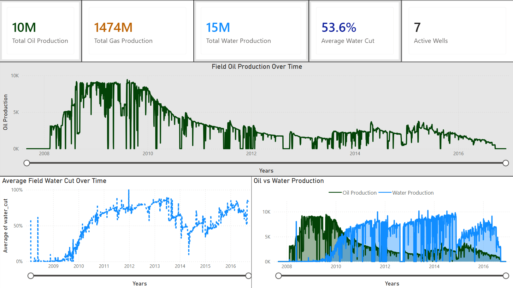
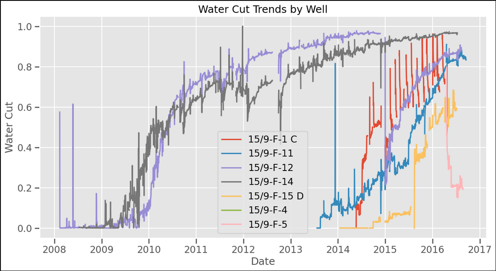
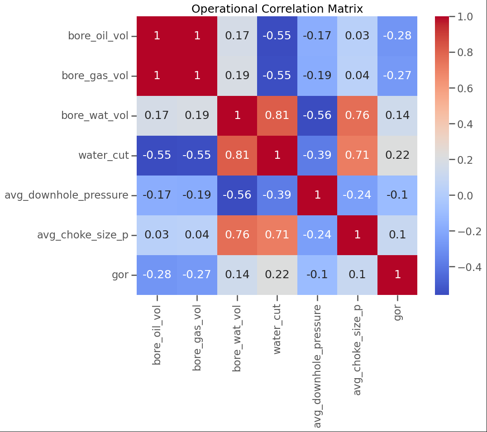

# Volve Field Production & Well Performance Analytics

## Project Overview

This project analyzes production and operational data from the Volve Field dataset using Python and Power BI.

The objective was to simulate a real-world oil & gas production surveillance workflow by analyzing:

- field production trends
- well performance behavior
- reservoir maturity indicators
- water cut evolution
- pressure depletion trends
- operational relationships between choke size, pressure, and production

The project combines:
- data cleaning
- exploratory data analysis (EDA)
- engineering analytics
- dashboard visualization

## Dataset

Dataset: Volve Production Data

Main variables used:
- Oil Production
- Gas Production
- Water Production
- Downhole Pressure
- Choke Size
- Well Names
- Production Dates

Source: Public dataset obtained from Kaggle for educational and portfolio purposes. https://www.kaggle.com/datasets/nazarmahadialseied/volve-field-production-dataset-oil-and-gas

## Tools & Technologies

- Python
- Pandas
- NumPy
- Matplotlib
- Seaborn
- Power BI
- Jupyter Notebook

## Workflow

### 1. Data Cleaning & Preprocessing
- standardized column names
- converted date formats
- handled missing values
- removed invalid records
- engineered production metrics

### 2. Exploratory Data Analysis
- field production trends
- well performance analysis
- water cut behavior
- pressure analysis
- choke-performance relationships
- decline analysis
- correlation analysis

### 3. Dashboard Development
Interactive Power BI dashboards were created for:
- executive production overview
- well performance monitoring
- operational analytics

## Key Insights

- Field production demonstrates clear long-term decline behavior.
- Water cut increased significantly during later production years.
- Production response varies considerably between wells.
- Larger choke sizes generally correspond to higher oil production.
- Pressure depletion trends are visible across multiple wells.
- Reservoir maturity indicators align with declining production performance.

## Power BI Dashboard

### Executive Overview
- field production KPIs
- oil/gas/water trends
- water cut monitoring

### Well Performance Analysis
- production contribution by well
- cumulative production
- decline trends

### Operational & Pressure Analytics
- pressure surveillance
- choke-performance relationships
- operational correlation matrix

## Sample Visualizations

### Field Oil Production Trend

### Water Cut Trends

### Operational Correlation Matrix

## Repository Structure

porosity-permeability-reservoir-characterization/
│
├── data/
│   ├── raw/
│   │   └── volve_production_raw.xlsx
│   │
│   └── cleaned/
│       ├── volve_cleaned.csv
│       └── kpi_summary.csv
│
├── notebooks/
│   └── volve_field_production_analytics.ipynb
│
├── outputs/
│   └── figures/
│       ├── field_oil_production.png
│       ├── cumulative_oil_by_well.png
│       ├── water_cut_trends.png
│       ├── pressure_trends.png
│       ├── operational_correlation_matrix.png
│       ├── decline_analysis.png
│       ├── operational_analytics_dashboard.png
│       ├── well_performance_dashboard.png
│       └── executive_dashboard.png
│
├── dashboard/
│   └── volve_dashboard.pbix
│
├── README.md
├── requirements.txt
└── LICENSE

## How to Run

1. Clone the repository
2. Install requirements
3. Open Jupyter Notebook
4. Run the notebook cells
5. Open Power BI dashboard (.pbix)

## Future Improvements

Potential future enhancements include:
- decline curve analysis (DCA)
- machine learning forecasting
- SCAL integration
- capillary pressure analytics
- real-time production surveillance
- reservoir engineering workflows

## Author

Tony Alawiel

Reservoir & Production Analytics Enthusiast  
Special Core Analysis (SCAL) Laboratory Background  
Interested in Data Analytics for Oil & Gas Applications
